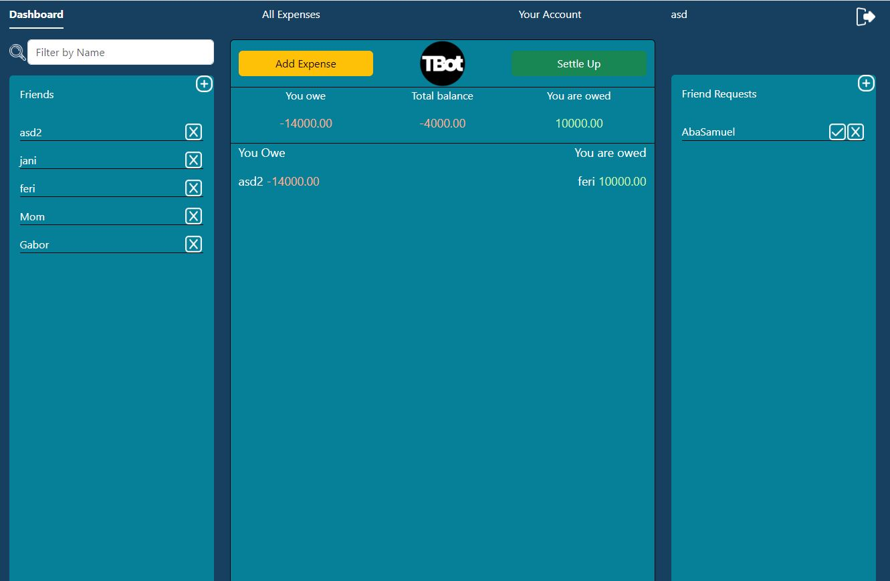
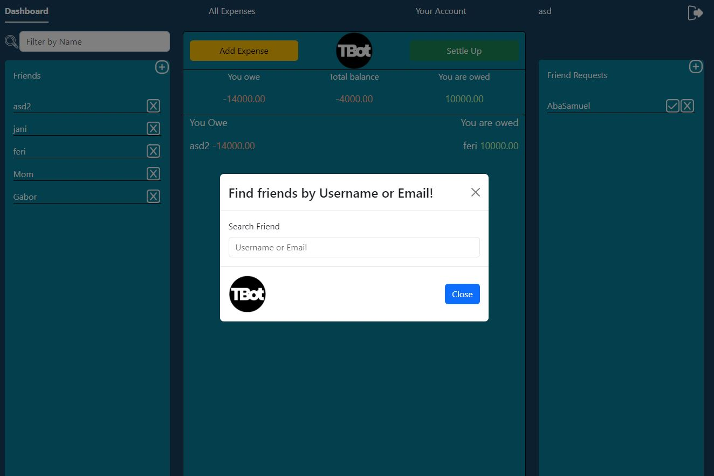
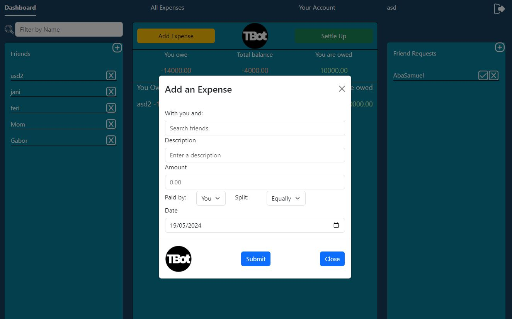
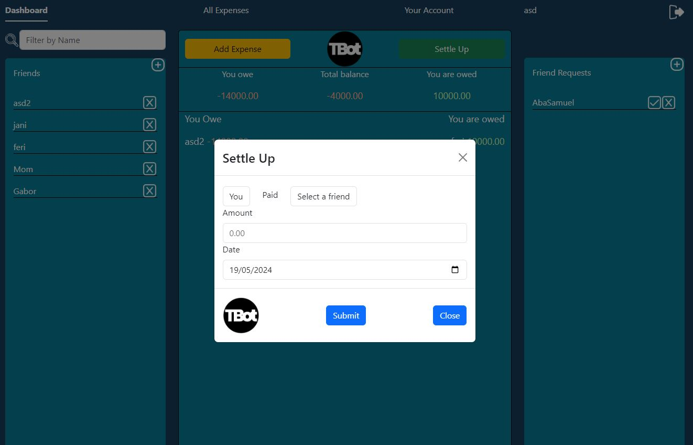
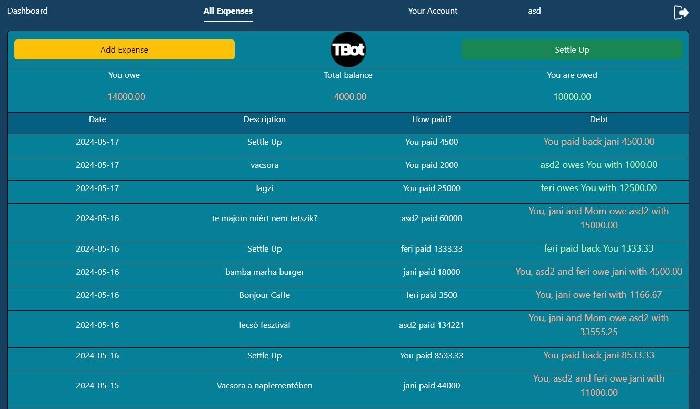

# TheBasisOfTrust

## Table of Contents

- [About The Project](#about-the-project)
- [Build With](#build-with)
- [Project Kanban](#project-kanban)
- [Features](#features)
- [Installation](#installation)

## About The Project

The Basis Of Trust is an application that helps the user easily and transparently manage debts between friends, because trust is based on accurate accounting.
After registering and logging in, you can easily find your friends by email or username and after accepting the friend request, you can generate Expenses or Settle Up.
For example, if 5 people went to the cinema and one person pays the cost, just quickly create an expense and add the participants, then TBOT will manage who and to whom it belongs.

## Build With

## Project Kanban

To see the structure of the sprints, you can open the kanban board:
https://trello.com/b/TDyH1Fcv/the-basis-of-trust

## Features

The dashboard shows who belongs to the user and to whom the user belongs to, as well as friends and friend requests:

Finding friends and sending requests with a search bar in the modal:

Create expense with the Add Expense button:

Settle Ups can be recorded also:

The user can check the entered expenses on the All Expenses page:

## Installation

1. step: Clone this repository.
2. step: Navigate to the TheBasisOfTrust map.
3. step: Use the "docker compose up" command in the terminal.
4. step: In the browser at localhost you can try and use the app.